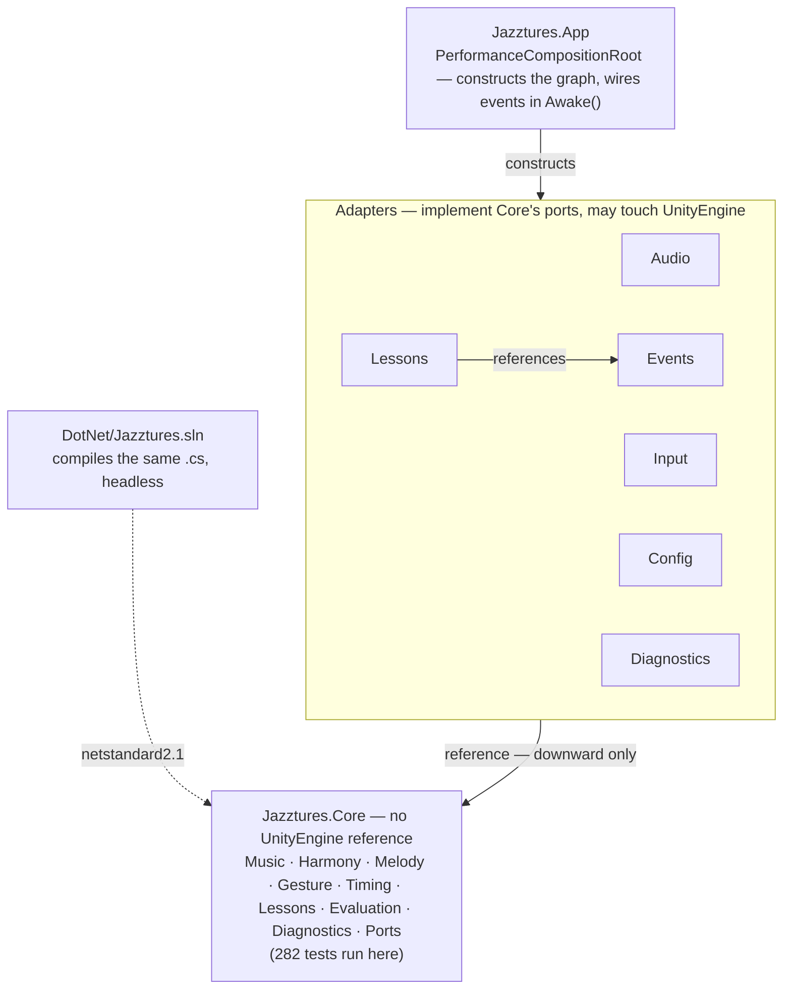
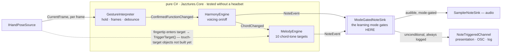
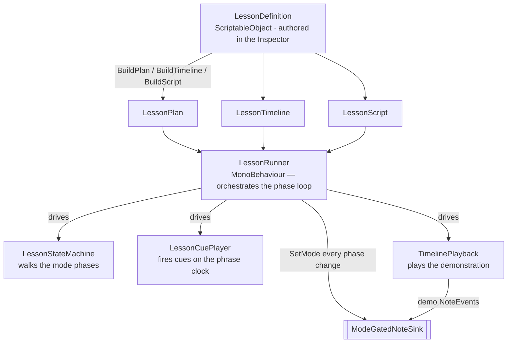

# Architecture — Jazztures

A map of how the codebase is built — not what it does. For *what* and *why*, read
`CLAUDE.md` (the spec) and `Docs/DECISIONS.md` (the ADR log). This file is a derived
overview; regenerate it when the assembly graph or the port set changes.

**As of:** branch `feat/m3-finish` — M0–M5 complete, 282 headless tests green.

---

## 1. The load-bearing rule

`Jazztures.Core` has **zero references to `UnityEngine`**. Chords, voicings, the
progression state machine, gesture timing, lesson state, onset scoring — all of it is
plain C#, and all of it compiles **twice**: once by Unity for the build, and once by
`DotNet/Jazztures.sln` as a `netstandard2.1` library so `dotnet test` exercises it with
no editor and no headset.

If a domain type seems to need a `Vector3`, the design is wrong — restate the problem or
define a domain struct. This is a thesis on a deadline with a user study booked; logic
that can only be tested by donning a headset does not get tested.

> **Consequence for every change:** new musical or lesson logic goes in `Core` with its
> edit-mode tests *in the same commit*. Unity assemblies stay thin — they adapt, wire,
> and render.

---

## 2. The assemblies

Ten assembly definitions. Dependencies point one direction — inward, toward `Core`. A
circular reference fails the build by design. `Jazztures.App` is the only assembly that
knows about all the others; it exists to wire them together.

Every arrow points down. The adapters depend on `Core`; `App` depends on everything;
`Core` depends on nothing. Because `Core` is engine-free, the `DotNet` test project
compiles the identical source and runs the full suite in CI without Unity.

### Ports and their adapters

`Core` defines the ports; the adapters implement them. Swapping a real hand-tracking
source for a recorded fixture, or on-device audio for a test spy, is a constructor
argument — nothing downstream changes.

| Port (Core interface) | Carries | Adapters |
|---|---|---|
| `IHandPoseSource` | one frame: candidate pose + per-hand tracking quality | `MetaXRHandPoseSource`, `KeyboardHandPoseSource`, `ReplayHandPoseSource`, `FakeHandPoseSource` |
| `INoteSink` | a `NoteEvent` (pitch, velocity, DSP time, channel, hand) | `SamplerNoteSink`, `ModeGatedNoteSink`, `ChannelNoteSink`, `CompositeNoteSink`, `NullNoteSink` |
| `IMusicalClock` | the current time, in DSP seconds | `DspMusicalClock` (`AudioSettings.dspTime`), `VirtualClock` (tests) |

---

## 3. The path from a hand to a sound

One frame of hand tracking becomes audio by flowing through the domain engines and out
to a sink. The direction never reverses: **input → domain → presentation**. A UI script
that called `HarmonyEngine.SetHeldFunction()` would be a bug.

**The mode gate is the one recent addition (M5).** Every `NoteEvent` reaches the
unconditional sink — sounded or not — so telemetry and analysis always describe the full
performance. Only the *audible* path is gated by the learning mode: in Watch & Listen
the learner is silent but logged; the system demonstration (Accompaniment channel) is
always audible.

### Three things hold this together

- **The clock.** Anything rhythmic reads `IMusicalClock` — `AudioSettings.dspTime` in
  the build, `VirtualClock` in tests. Never `Time.deltaTime`.
- **The composition root.** `PerformanceCompositionRoot.Awake()` is the entire wiring,
  in about forty lines. One per scene. No singletons, no `FindObjectOfType` in the
  domain.
- **Event channels.** Cross-assembly messages travel on `ScriptableObject` channels
  (`ChordChangedChannel`, `NoteTriggeredChannel`, …). `DomainEventBridge` is the one
  place domain events are forwarded onto them; presentation only ever subscribes.

---

## 4. How a lesson drives the system (M5)

A lesson is a `ScriptableObject` — pure data, authored in the Inspector. At load it
bakes into three immutable `Core` objects, and `LessonRunner` (the one `MonoBehaviour`
here) drives them: each phase it re-points the mode gate, plays the demonstration,
advances the cue track on the phrase clock, and — in Test Yourself — scores the attempt
when the phrase ends.

**The asset is data; the behaviour is the runner.** Adding a lesson means a new
`LessonDefinition` asset — no C# change (§3.9). `LessonRunner` also raises
`LessonPhaseChannel`, `EvaluationResultChannel` and `GhostFrameChannel` for
presentation; captions and the ghost-hand mesh are wired but not yet rendered.

---

## 5. Where the code lives

| Subsystem | Path | State |
|---|---|---|
| Pitch, chords, voicings, chord-tone targets | `Core/Music` | done · tested |
| Progression state & harmony engine | `Core/Harmony` | done · tested |
| Melody engine & velocity mapping | `Core/Melody` | done · tested |
| Clock, tempo, swing, metronome | `Core/Timing` | done · tested |
| Gesture temporal state machine, record/replay | `Core/Gesture` | done · tested |
| Learning modes, lesson timeline & cue track, state machine | `Core/Lessons` | done · tested |
| Onset scoring (Test Yourself) | `Core/Evaluation` | done · tested |
| Latency percentiles, hand-pose recorder | `Core/Diagnostics` | done · tested |
| Sampler, voice pool, DSP clock, piano bank | `Audio/` | verified in editor |
| Hand-pose sources, keyboard input | `Input/` | keyboard ok · Quest adapters unverified on device |
| ScriptableObject event channels | `Events/` | done |
| Lesson assets, `LessonRunner` | `Lessons/` | verified in editor |
| Right-hand touch-target GameObjects (PokeInteractor) | — | not built · domain ready |
| Ghost-hand renderer | — | not built · ADR-0012 spec'd |
| SMF lesson importer | — | M6 |
| OSC + JSONL telemetry sinks | — | M7 |

---

## 6. Read in this order

1. **`CLAUDE.md`** — the specification. Every rule is tagged `[THESIS]` (fixed),
   `[TUNABLE]` (an engineering default, pilot-calibrated later), or `[OPEN]`
   (unresolved). Start with §1–§3.
2. **`Docs/DECISIONS.md`** — twelve ADRs, each recording a deliberate deviation from the
   proposal (RtMidi, the Sibelius pipeline, `record struct`, the gesture-recognition
   split, ghost hands). Read these before questioning a design choice.
3. **`Assets/Jazztures/App/PerformanceCompositionRoot.cs`** — read `Awake()` top to
   bottom. It is the architecture, executable, in forty lines.
4. **`Assets/Jazztures/Core/Harmony/HarmonyEngine.cs` + its test** — the smallest
   complete example of the pattern: a domain service, its plain-C# events, and a
   headless test that drives a scripted gesture sequence and asserts the exact note
   stream.

---

## 7. Decisions the ADR log carries

Full text in `Docs/DECISIONS.md`.

| ADR | Decision |
|---|---|
| 0012 | Ghost hands: translucent articulated mesh over the learner's own hands; target spheres light in sequence (no ghost fingertip); continuous pose morphing. Rhythm-game "fly at you" rejected on cognitive-load grounds. |
| 0011 | Lesson content: a Standard MIDI File bakes the musical timeline; text/visual cues are a separate authored script. Sibelius `.sib` (proprietary, no reader) dropped. |
| 0010 | Gesture recognition: the Meta SDK does per-frame pose matching; a pure-`Core` `GestureInterpreter` does all the timing. A custom classifier can't be defended in a viva. |
| 0009 | `.asset` files kept out of Git LFS (they are Force Text serialised — must stay diffable). |
| 0008 | Piano: Salamander Grand V3 samples (CC-BY 3.0), played locally. MIDI is only a wire format to the DAW — no MIDI library on device. |
| 0007 | Domain value types are `readonly struct : IEquatable<T>`, not `record struct` — Unity 6000.5 compiles at C# 9. |
| 0006 | Left-hand pose assets rebuilt from scratch, not salvaged from the prototype. |
| 0005 | Right-hand input is mid-air touch targets, not finger curl. Curl is the piano-mimicking metaphor co-design rejected. |
| 0004 | Unity pinned at `6000.5.0f1` (Tech stream, not a `6000.0` LTS). |
| 0003 | Meta XR All-in-One SDK pinned at `205.0.0` / audio `85.0.0` / voice `85.0.1`. |
| 0002 | The domain is tested headless via a parallel .NET SDK-style build over the same source files. |
| 0001 | The earlier prototype under `Assets/Scripts/` was deleted, not extended. |
